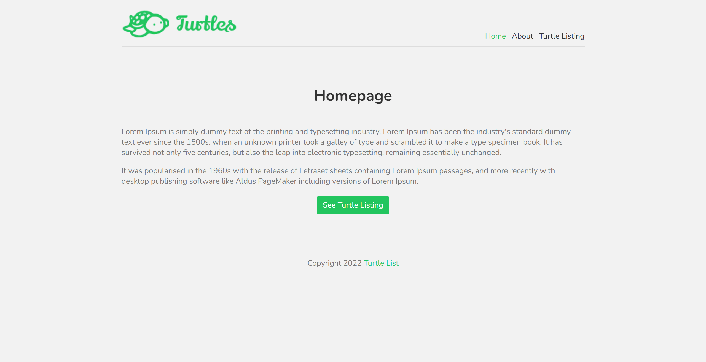

# Turtle List

[View Live Site](https://turtle-list.vercel.app/)

My first Next.js project. Just a simple website that show a list of turtles.

This is a [Next.js](https://nextjs.org/) project bootstrapped with [`create-next-app`](https://github.com/vercel/next.js/tree/canary/packages/create-next-app).

## Preview

## Tech stack

- [Nextjs](https://nextjs.org/)
- [React](https://reactjs.org/)

## Show your support

Give a ⭐️ if you like this project!

## License

[MIT](LICENSE)
